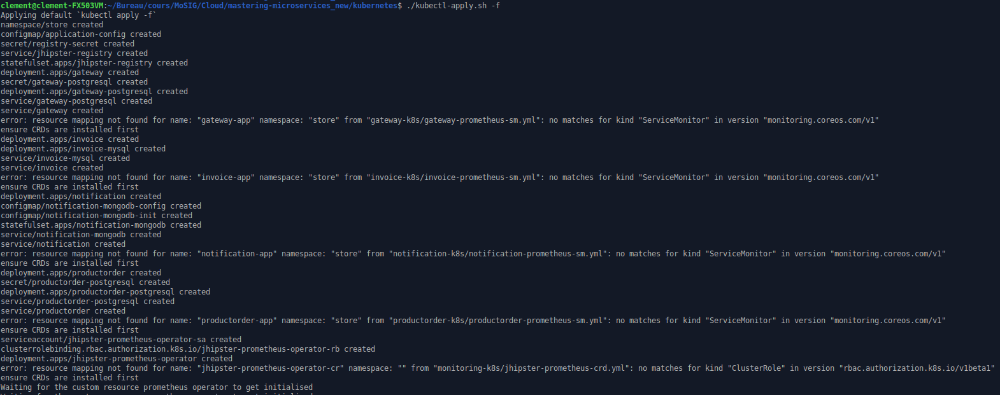
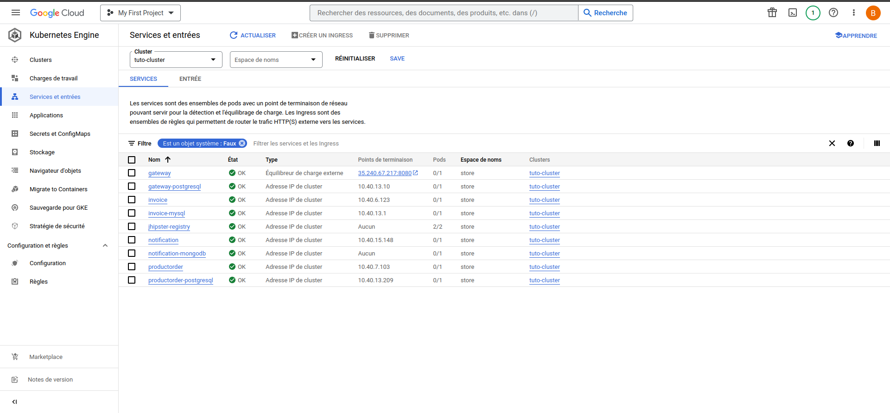
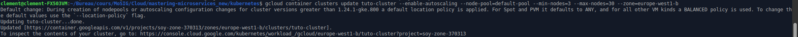

This is the report for the "Mastering microservices" lab.
I did it alone (Clément Morand)
and the code is available at [this adress](https://github.com/blubrom/-Cloud-MasteringMicroservices)

I followed the [instructions](https://github.com/mastering-microservices/tutorial_en/tree/main/microservices) as well as I could.

when I arrived to deploying on docker, I used my docker account named `blubrom`

I then created a cluster and connected to it before running `./kubectl-apply.sh -f`
It resulted in the following:

On GCP it looks like this

Since The created cluster did not have enough pods, I proceded to allowing it to autoscale

however, it fails to provide the number of pods I wanted because the memory quota is reached.

For this reason, I was not able to pursue further.

All the code generated and used is available on the repo.